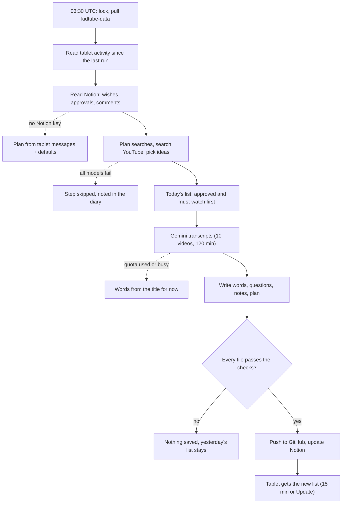

# KidTube: how it works

*As of 2026-10-02.*

## Overview

KidTube has five parts. They never talk to each other directly. Everything goes through files in the private GitHub repo `kidtube-data`; you also use Notion.

| Part | Where it runs | What it does | Reads | Writes |
| --- | --- | --- | --- | --- |
| Tablet extension (KidTube 0.5.0) | Quetta browser on the tablet | Shows only the planned videos, the talking friend and the questions. Enforces hours, minutes and locks. | `queue.json`, `parent-config.json`, `characters/` | `activity/<day>.json`, `transcripts/` (when it can), rule changes |
| Data repo `kidtube-data` | GitHub (private) | The one place everything is stored. Every push is checked. | — | — |
| Daily helper | This server, 03:30 UTC (crontab) | Plans the list, finds videos, gets transcripts, writes the friend's words and the questions | data repo, Notion, YouTube search | data repo, Notion |
| Notion "Kids Content Manager" | Notion | Where you approve videos, write wishes and comments, and read the plan | — | — |
| AI services | Google Gemini, OpenRouter (free models) | Gemini watches videos; the text models plan and write | what the helper sends | answers only |

The tablet syncs with GitHub every 15 minutes, and also when you press **Update**. The helper runs once a day. Claude (in a chat in this repo) can change the code, run the helper by hand, and edit Notion.

## Kid flow on the tablet

He only sees the list, the talking friend and the video. Any other YouTube page sends him back to the list.

1. **He opens YouTube in Quetta.** The extension covers the page with his list.
    - Outside the watching hours, over the daily minutes, or after "no more videos today": he gets a lock screen ("Videos are sleeping", "That's all for today" or "Good work today").
    - Another site typed in the address bar is blocked. Only the allowed sites open.
2. **The list.** Today's videos from `queue.json`, minus the ones he has watched, at most "Videos on the home screen".
    - ⭐ videos are must-watch. How they work depends on the must-watch rule:
        - *first*: the other cards are greyed out ("⭐ first") until every ⭐ video is watched.
        - *mix*: one ⭐ video, then one free choice, and so on.
        - *off*: ⭐ is only a mark.
    - Tapping a greyed card only wiggles it and the stars.
3. **He taps a video.**
    - Intro on: the talking friend's screen opens. He taps the friend (browsers only speak after a tap), and the friend waves and says the intro. A Russian video gets a Russian voice.
    - Intro off: straight to the video.
4. **Watching.** YouTube's player shows; everything else is hidden. The strip below shows the other cards, locked with a countdown until the minimum watching time has passed.
    - Skipping forward and speeding up are blocked unless *Allow skipping* is on.
    - If the daily minutes run out, the video pauses and the lock screen shows.
    - If he leaves early (after the minimum time), the video counts as watched if he watched long enough, and he goes back to the list.
5. **The video ends.**
    - Outro on, or questions waiting: the friend's screen shows what we learned, then each question.
    - Otherwise: back to the list.
6. **Each question.**
    - *Voice*: the microphone opens by itself and he says the answer.
        - If the tablet has no microphone, he gets a box to type into from then on.
        - If he says nothing: "Tap the 🎤 and say it again".
    - *Choice*: big buttons in random order.
    - Right answer: praise, and the friend jumps.
    - Wrong answer: "Try again", up to *Tries per question*. After that the friend says "The answer is …".
7. **After the questions**, the rule *After N wrong answers* decides:
    - *continue*: back to the list.
    - *rewatch*: the same video once more (once a day).
    - *no more videos today*: lock screen until tomorrow. A parent can undo it with *Reset today*.
8. **Every step is logged** to `activity/<day>.json`: seconds watched, why it ended, and every answer.

A parent can skip any friend screen with the 🔒 button and the PIN.

## Parent flows

You can steer from three places. All of them end up in the data repo or Notion, and the helper reads them on its next run.

**On the tablet** (⚙️ button, then the PIN):

| What you do | What happens |
| --- | --- |
| **Update now** | Pulls the newest list, rules and app version right away (otherwise every 15 min) |
| Change **Rules** (hours, minutes, must-watch order, talking friend, questions) | Works on the tablet at once and is saved to `parent-config.json`, so the helper sees it |
| **Message to the helper** | Saved as a `wish` event. The next run copies it to the bottom of *Wishes and settings* in Notion and acts on it. |
| 👍 / 👎 / comment on a watched video | Saved as a `parentNote`. The helper uses it for *What the helper noticed* and future picks. |
| Tap a watched video's picture | You watch it yourself with skipping allowed. It doesn't count for him. |
| **Reset today** | Gives back today's minutes and undoes "no more videos today" |

**In Notion** (Kids Content Manager):

| What you do | What the helper does on its next run |
| --- | --- |
| Edit *Wishes and settings* (Always, This month, This week, Today, Numbers) | Plans searches and the list from it. *Numbers* sets videos per day, ideas per day, language minimums and the must-watch order. |
| Fill in *About him* | Uses it for every choice and every text. Never changes it. |
| Tick **Approved** on a video | Puts it on the list before the helper's own picks |
| Set **Status = No** | Never shows it |
| Set **Must watch** or **Must watch today**, or a **Day** | Shows a ⭐ on the tablet. *Must watch today* goes first on that day and carries over until watched. |
| Write a **Parent comment**, or a comment on a page | Reads it as feedback for picks, *What the helper noticed* and the study plan |
| Comment on a line of the *Study plan* | Rewrites the plan with your comment |
| Add a **Custom** quiz template | Uses it for videos where it fits |

**In a chat with Claude** in this repo: say what you want, for example "one Russian fairy tale a day", "harder questions" or "run it now". Claude edits the wishes, the code or the prompts, or runs the helper by hand.

## The daily helper run

One run takes about 10–20 minutes. It uses about 15 text-model calls and up to 10 Gemini videos. It starts at 03:30 UTC from the server's crontab (`node agent/run.mjs`).



1. **Lock and fetch.** Only one run at a time. It pulls a fresh copy of `kidtube-data`.
2. **Read the tablet's activity** since the last run.
    - A video watched to the end, or longer than the minimum, becomes *Watched*.
    - Thumbs, comments and quiz answers are remembered for the notes.
    - Messages to the helper are collected.
3. **Read Notion** (only if the helper has its own Notion key).
    - It reads the four pages (wishes, about him, noticed, plan), the Videos table, comments and quiz templates.
    - Your *Approved*, *No*, *Must watch*, *Day* and *Parent comment* win over the helper's own choices.
    - Tablet messages are added to *Wishes and settings*.
    - Without a Notion key it plans from the tablet messages and its defaults only.
4. **Understand** (text model): what you want now, the numbers for today, and 4–8 YouTube searches. If every model fails, it uses the defaults and searches nothing.
5. **Search YouTube** from the server. It keeps only new videos of the right length from channels that aren't blocked.
6. **Choose** (text model): up to *New ideas per day* become **Ideas**, each with a reason, topics and a language.
7. **Make today's list** in this order:
    1. *Must watch today*
    2. approved *Must watch*
    3. other must-watch videos
    4. approved videos
    5. the helper's own ideas, only if there aren't enough approved ones
    6. videos flagged as too hard, last

   Then it applies the language minimums. Yesterday's unwatched videos go back to *Planned*.
8. **Transcripts** (Gemini): today's videos first, then new ideas, then planned ones, until 10 videos or 120 minutes of video.
9. **Words and questions** (text model) for every video that needs them: today's videos, new ideas, and planned videos whose transcript just arrived.
10. **Write the files:**
    - `queue.json`: today's list, plus `upcoming` so the tablet fetches those transcripts too
    - `parent-config.json`: the questions and the must-watch order
    - `memory.json`: everything the helper knows
    - `transcripts/`
11. **Notes** (text model):
    - *What the helper noticed*: every run
    - the *Study plan*: on the first run, weekly, or when your wishes or plan comments change
    - a diary entry
12. **Check and save.** `validate.mjs` checks every file.
    - If a file fails, nothing is saved and the run stops, with the reason in the log.
    - If all pass, it commits and pushes. If the tablet pushed meanwhile, the helper puts its commit on top and pushes again.
13. **Update Notion** (only with its key): table rows, video pages, noticed, plan and diary.

The tablet picks up the new list on its next sync (15 min) or when you press **Update**.

## Gemini: transcripts

Gemini is asked for one thing only: what is said and what is shown. Everything else (summary, intro, outro, questions) is written afterwards by the text models, from that transcript.

YouTube blocks servers, but not Google: the helper sends Gemini the public video link, and Google's servers open the video themselves. Nothing about him or your notes is sent.

**The request, word for word** (one per video):

```text
[the video: https://www.youtube.com/watch?v=<id>]

You are making a transcript of a children's video for a parent.
Write everything that is said, in the video's own language (do not translate),
and the things a child would notice on screen.
Only what is really said and shown.
```

The answer must follow a fixed shape:
- `language`
- `transcript`: lines with a time, about every 10–20 seconds
- `onScreen`: lines like "[1:54] Word banner: EVAPORATE"

The temperature is 0.2, so it sticks to what is there.

**What the helper does with it:**
1. It saves `transcripts/<id>.json`, with kind `ai` and source `gemini`.
2. The text models use the transcript and the on-screen lines for the words, the questions and the age check. Questions like "What colour is…?" are allowed because of `onScreen`.

**Limits** (in `agent/config.json`, under `transcripts`):

| Setting | Now | Meaning |
| --- | --- | --- |
| `maxVideosPerDay` | 10 | videos Gemini may watch per day |
| `maxMinutesPerDay` | 120 | total minutes of video per day |
| `secondsPerRequest` | 120 | how long to wait for one model before giving up on it |
| `models` | 3.5 Flash Lite, 3.7 Flash, 3.8 Flash, 3.5 Flash, Flash latest | tried in this order |

**When something goes wrong:**
- A model is busy (503), gone (404) or too slow: it moves to the back of the line for this run and the next model is tried.
- The free daily quota is used up (429): no more Gemini today. Those videos keep words written from the title.
- A video would go over the minutes left: it is skipped today and tried tomorrow.
- The tablet still uploads YouTube's own captions when it is on. A transcript that already exists is never fetched again.

Google's free tier allows about 8 hours of YouTube video a day. On the free tier, Google may use requests to improve its products.

## Words and questions (text models)

Four kinds of request go to free models on OpenRouter. Each answer is checked, and sent back for a fix when it breaks a rule. The prompts are in `agent/lib/prompts.mjs` and `agent/PROMPT.md`.

| Request | It gets | It returns | Checks before use |
| --- | --- | --- | --- |
| **Understand** | your wishes, About him, noticed, plan, new messages and comments, what he watched and answered, the planned list | a summary of what you want now, numbers for today, 4–8 YouTube searches, things to avoid | searches present |
| **Choose** | search results (title, channel, minutes, language), the wishes summary, About him | up to N picks, each with a reason, topics, language and must-watch | every pick is one of the results |
| **Words** (per video) | title, channel, transcript and on-screen lines (or "title only"), the friend's name, About him, quiz templates | summary, what he learns, intro (≤ 400 chars), outro (≤ 600), things to talk about, up to 2 questions, a too-hard flag | lengths; a Russian video gets Russian text; every answer is 1–2 everyday words or a number ≤ 20 |
| **Notes** | everything above, plus today's journal and the tablet rules | *What the helper noticed*, the *Study plan* (when due), a diary line | not empty |

**Rules every text follows:**
- Your words win over the helper's ideas.
- Only calm, kind videos.
- Only words a 4–5-year-old knows.
- Questions only about what the video really says or shows.
- No hard terms or big numbers.
- No catchphrase: the tablet adds the friend's catchphrase itself.

**Quiz templates.** Math questions are made by code, so the right answer is always right:

| Template | Example | He answers |
| --- | --- | --- |
| Adding (`add`) | What is 3 plus 4? | says 7 |
| Taking away (`subtract`) | What is 7 minus 2? | says 5 |
| What comes next | What number comes after 6? | says 7 |
| What comes before | What number comes before 5? | says 4 |
| Which is bigger | Which is bigger: 4 or 7? | taps 7 |
| Say it: about the video | How many wheels does the wheelbarrow have? | says one |
| Tap it: about the video | What do bees make? honey / milk / bread | taps honey |

English and Russian number words both count ("seven", "семь", "7"). Without a transcript, only math questions are made; the others wait until the transcript arrives.

**Models.** The list of free models is refreshed daily:
1. the preferred ones first (Nemotron 3 Super, Qwen 3.8, Gemma 4),
2. then the rest, by how well they did before.

A busy model rests for 30 minutes. A paid model can be added as a last resort (`llm.paidModel`).

## Where everything lives, and failures

The code is public (`andyvauliln/kidtube`). Everything about him is private (`andyvauliln/kidtube-data`, Notion). The keys live in one file on the server.

| What | Where |
| --- | --- |
| Extension code, helper code, prompts, schemas | `kidtube` repo. The extension is published on GitHub Pages and updates itself. |
| Today's list, rules, questions | `kidtube-data`: `queue.json`, `parent-config.json` |
| What he did | `kidtube-data/activity/<day>.json` |
| Transcripts | `kidtube-data/transcripts/<video id>.json` |
| The helper's memory (every video, its status, words and Notion link) | `kidtube-data/memory.json` |
| Pikachu drawing | `kidtube-data/characters/pikachu.svg` |
| Keys (OpenRouter, Gemini, later Notion) | `~/.config/kidtube/agent.env` on the server, readable only by your user |
| Helper log, model stats, Gemini usage | `~/.local/share/kidtube/state/` on the server |
| Helper settings (schedule, limits, models) | `agent/config.json` |

| If this fails | What happens |
| --- | --- |
| A free text model is busy or gives bad JSON | The next model is tried and the run goes on |
| All text models fail for a step | That step is skipped (no new ideas, or the old words are kept) and listed in the diary |
| The Gemini quota is used up | The rest get words from their titles; transcripts come tomorrow |
| YouTube search is blocked | No new ideas today; the list is made from planned videos |
| The new files fail the checks | Nothing is saved; the tablet keeps yesterday's list |
| The server is off at 03:30 | No run that day; the next run catches up on all activity |
| The tablet is offline | It keeps the last good list; its events wait and are sent later |
| The Notion key is missing | The daily run doesn't read or update Notion |

## Not built yet

None of these exist today. Each one is your choice.

**YouTube likes.** Your 👍 / 👎 stay in our files; YouTube never sees them. YouTube learns only from the Google account signed in on the tablet, if there is one: what is watched there shapes that account's recommendations.
- Possible: when you tap 👍 on the parent page, the extension also presses YouTube's own Like button for that account.
- Needs: the tablet signed in to a Google account.

**YouTube's recommendations as ideas.** There is no official way to read someone's recommendations, and the server can't sign in. The tablet can, though: YouTube already loads the home feed and the "up next" list beside each video, which we hide from him.
- Possible: the extension saves those videos to `suggestions/<day>.json`, and the helper adds them to its search results with the same checks (length, channel, age, your approval).
- Without a signed-in account the feed is generic and less useful.

**More from Gemini.** It could write the words and questions itself in the same call, since it saw the video. That would be one call instead of two, with better questions about what's shown. It can't hand back frames from the video, but YouTube's own thumbnails can be shown.

**Pictures.** Google's image models (Gemini image models on the same key) can draw new pictures: picture questions ("tap the triangle"), flashcards, Pikachu poses. The tablet would need a picture-question type, which means a new version.

**Charts.** Quiz results by skill and minutes per day can be shown as Notion chart views over the Videos table.
